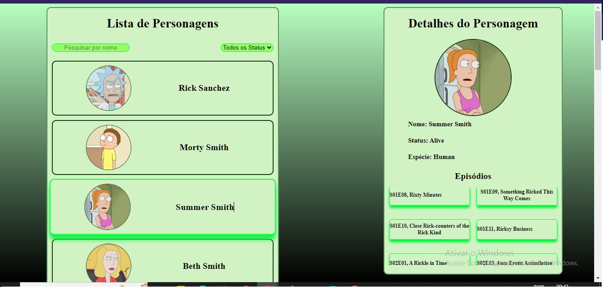

<h1 align="center" href="#clipboard-about"> Rick and Morty </h1>

## :clipboard: About:
Hi, I'm [Alexsander Marchi Zunino](https://www.linkedin.com/in/alexsander-marchi-zunino-226332170/) and here I show a project using Rick and Morty API to make an interface where you can see the characters, with searching and filter options.

  
   

